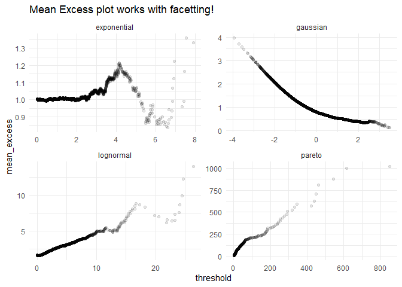
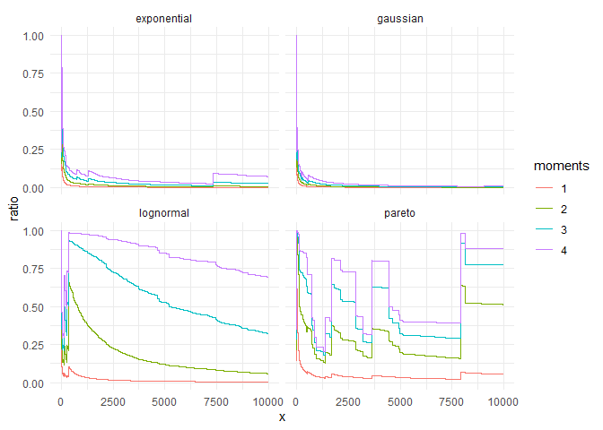

<!-- README.md is generated from README.Rmd. Please edit that file -->

# ggtails

<!-- badges: start -->

<!-- badges: end -->

The goal of ggtails is to make the use of fat tails specific plots as
easy as possible within the usual `ggplot2` framework. To do so, I took
the computational steps in the great `evir` package and turned them into
`ggplot2` stats.

## Installation

``` r
# install.packages("devtools")
devtools::install_github("David-Salazar/ggtails")
```

## Example

For example, you can create a zipf plot for different random variables
in the same way as would use `stat_qq()`

``` r
library(ggtails)
library(tidyverse)

gaussian <- rnorm(10000)
lognormal <- rlnorm(10000)
exponential <- rexp(10000)
pareto <- 1/(runif(10000))^(1/1.16) # inverse transform sampling

tibble(sim = 1:10000, lognormal, exponential, pareto) %>% 
  pivot_longer(-sim, names_to = "random_variable", values_to = "value") %>% 
  ggplot(aes(sample = value, color = random_variable)) +
  stat_zipf(alpha = 0.1) +
  scale_x_log10() +
  scale_y_log10() +
  theme_minimal() +
  labs(title = "Zipf plot in ggplot2 workflow",
       x = "Log(x)",
       y = "Log(Survival(x))")
```


In the same way, we can create a mean excess plot:

``` r
tibble(sim = 1:10000, gaussian, lognormal, exponential, pareto) %>% 
  pivot_longer(-sim, names_to = "random_variable", values_to = "value") %>% 
  ggplot(aes(sample = value)) +
  stat_mean_excess(alpha = 0.1) +
  facet_wrap(~random_variable, scales = "free") +
  theme_minimal() +
  labs(title = "Mean Excess plot works with facetting!")
```



``` r
tibble(sim = 1:10000, gaussian, lognormal, exponential, pareto) %>% 
  pivot_longer(-sim, names_to = "random_variable", values_to = "value") %>% 
  ggplot(aes(sample = value)) +
  stat_max_sum_ratio_plot(p = 4) +
  facet_wrap(~random_variable) +
  theme_minimal()
```


